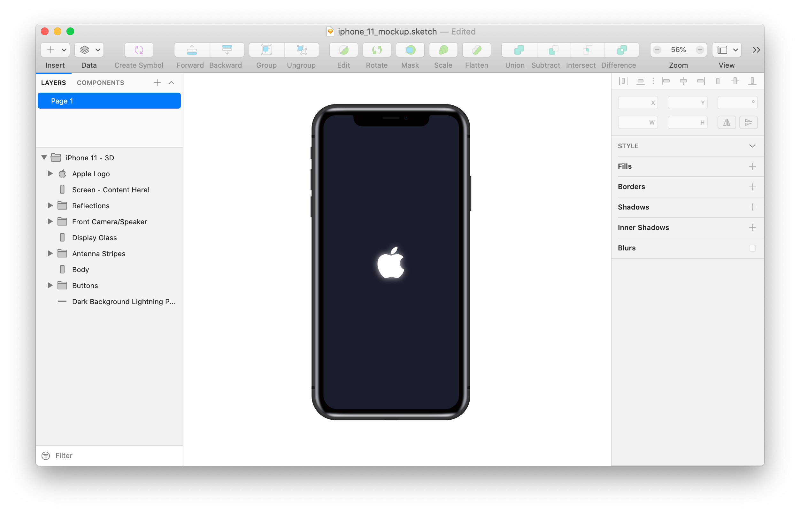

# iPhone 11 Mockup

3D(ish) mockup of a black iPhone 11. Made in Sketch with neatly named layers. So it should be easily customizable to get different colors or models.

### Full Disclosure 

This is my *first sketch project ever*, so don't expect high quality! I needed a simple Mockup and everything a quick Google Search brought up was pixel based. Since I wanted to embed the mockup (or a 2D version of it) in a website, I needed something vector based. I'm quite happy with how it turned out, so I thought I'd share it.

### Issues

If you find any issues or have constructive ideas, feel free to create an Issue. Just know that I won't spend any time creating personalized versions for random people! If you don't know how to use use Sketch to customize this mockup, I recommend trial and error. The mockup was created with zero prior knowledge of Sketch in about two hours.

### Pull Requests Are Always Welcome

If you wan't to improve the mockup or wan't to create (a) different version(s), pull requests are always welcome!
